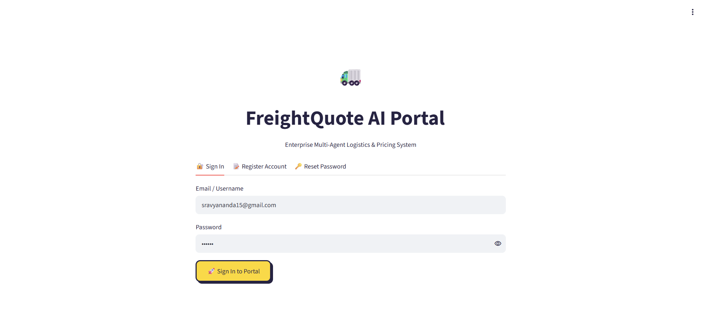
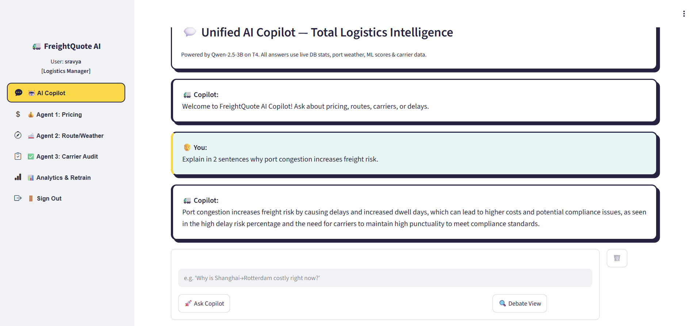
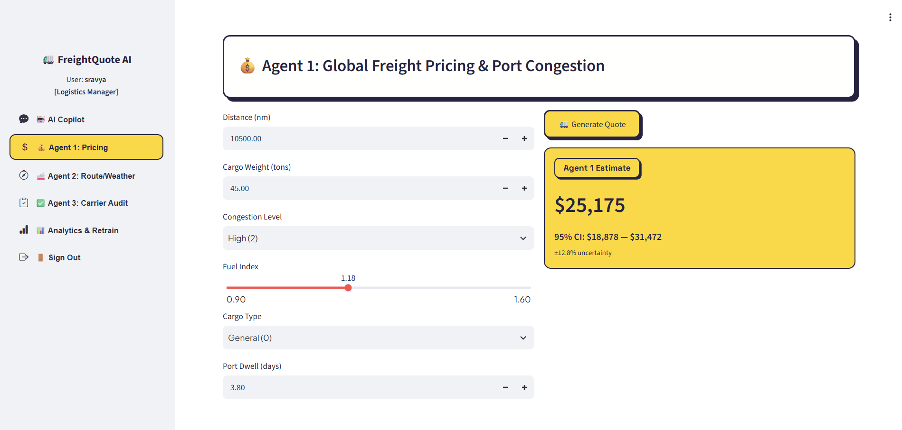
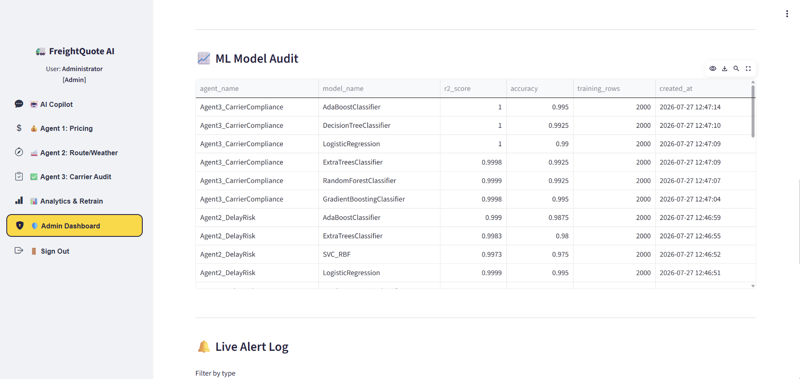
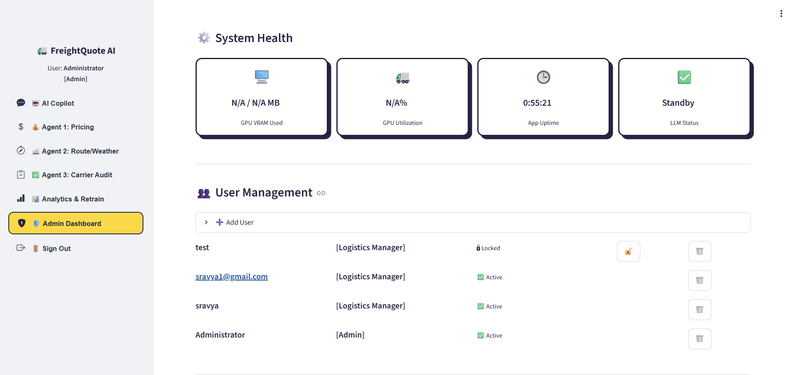
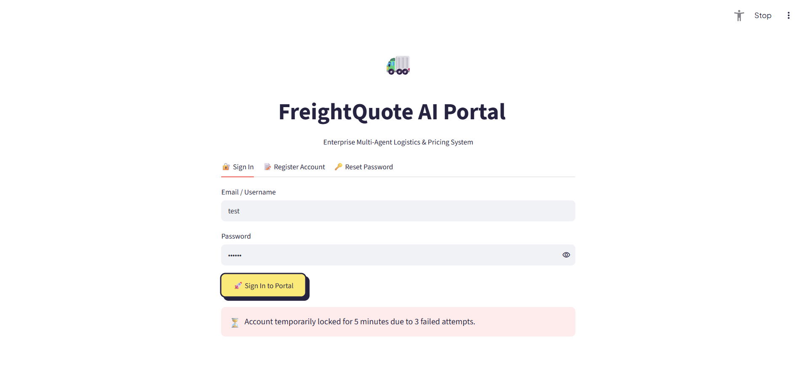
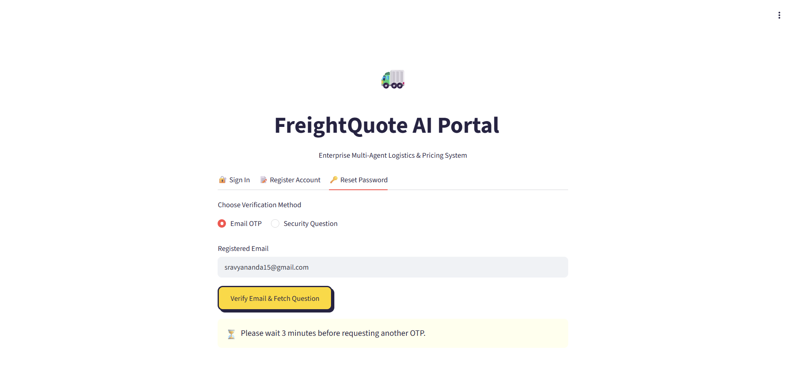

# 🚛 FreightQuote AI – Milestone 2

## Enterprise Multi-Agent Logistics Intelligence Platform

FreightQuote AI is an AI-powered logistics decision support platform developed as part of the **Infosys Springboard Milestone 2** project. The application combines Machine Learning, Large Language Models (LLMs), enterprise authentication, predictive analytics, and intelligent logistics agents into a unified platform for freight cost estimation, shipment analysis, carrier evaluation, and administrative management.

Milestone 2 significantly enhances the capabilities introduced in Milestone 1 by integrating enterprise-grade AI, secure user authentication, analytics dashboards, multi-agent collaboration, and ML model lifecycle management.

---

# 🚀 What's New in Milestone 2

Milestone 1 focused on building a machine learning-based freight quote prediction system with a basic user interface.

Milestone 2 extends the project by introducing advanced enterprise-level features including:

- Multi-Agent AI Copilot
- Three specialized logistics AI agents
- ML Model Management and Audit
- Enterprise Analytics Dashboard
- Secure User Authentication
- Role-Based Access Control (RBAC)
- Password Strength Validation
- Progressive Account Lockout
- Email OTP Password Recovery
- Security Question Password Recovery
- User Management Module
- Live Alert Monitoring
- One-Click Model Retraining
- Professional Streamlit Interface

These enhancements transform the project from a simple ML application into a complete enterprise logistics intelligence platform.

---

# ✨ Features

## User Features

- Secure User Registration
- Secure Login System
- Freight Quote Prediction using Machine Learning
- AI Logistics Copilot
- Password Reset using Email OTP
- Password Reset using Security Question
- Password Strength Validation
- Progressive Account Lockout
- Interactive Streamlit Dashboard

---

## Administrator Features

- Add Users
- Delete Users
- Unlock Locked Accounts
- Enterprise Analytics Dashboard
- ML Model Audit
- Model Performance Monitoring
- Model Retraining
- User Activity Monitoring
- Live Alert Dashboard

---

# 🤖 Multi-Agent AI System

The AI Copilot uses three specialized logistics agents that collaborate to provide intelligent responses.

## Agent 1 – Pricing Intelligence

Responsibilities:

- Freight Cost Estimation
- Fuel Cost Analysis
- Port Congestion Impact
- Pricing Recommendations

---

## Agent 2 – Route & Weather Intelligence

Responsibilities:

- Weather Risk Analysis
- Route Optimization
- Delay Prediction
- Shipment Planning

---

## Agent 3 – Carrier Compliance & Audit

Responsibilities:

- Carrier Reliability Analysis
- Compliance Verification
- Performance Evaluation
- Risk Assessment

The orchestrator combines responses from all three agents to generate a concise and intelligent recommendation for the user.

---

# 🏗️ System Architecture

```
                           User
                             │
                             ▼
                  Streamlit Web Application
                             │
        ┌────────────────────┼────────────────────┐
        │                    │                    │
        ▼                    ▼                    ▼
 Authentication        AI Copilot          Admin Dashboard
        │                    │                    │
        ▼                    ▼                    ▼
   SQLite Database     Multi-Agent AI      Enterprise Analytics
                             │
        ┌────────────────────┼────────────────────┐
        ▼                    ▼                    ▼
 Agent 1 Pricing      Agent 2 Route       Agent 3 Carrier
    Intelligence      & Weather AI          Audit AI
                             │
                             ▼
                  Machine Learning Models
                             │
                             ▼
                Freight Quote Prediction
```

---

# 📊 Milestone 2 Phase Architecture

| Phase | Description |
|--------|-------------|
| Phase 1 | User Registration & Authentication |
| Phase 2 | Freight Quote Prediction using Machine Learning |
| Phase 3 | AI Copilot with Three Specialized Logistics Agents |
| Phase 4 | Enterprise Analytics Dashboard & User Management |
| Phase 5 | ML Model Audit, Retraining & Security Features |

---

# 🔒 Security Features

FreightQuote AI implements multiple enterprise security mechanisms including:

- Role-Based Access Control (RBAC)
- Secure Password Hashing
- Email OTP Verification
- Security Question Recovery
- Password Strength Validation
- Progressive Account Lockout

### Progressive Account Lockout Policy

| Failed Attempts | Action |
|----------------|--------|
| 3 | Account locked for 5 minutes |
| 4 | Account locked for 15 minutes |
| 5 | Permanently locked until unlocked by Admin |

### OTP Cooldown Policy

- First Request → 60 Seconds
- Second Request → 3 Minutes
- Third Request → 5 Minutes
- Further Requests → 1 Hour
# 🛠️ Technology Stack

| Category | Technologies Used |
|----------|-------------------|
| Programming Language | Python 3 |
| Frontend | Streamlit |
| Database | SQLite |
| Machine Learning | Scikit-learn, Pandas, NumPy |
| Deep Learning | PyTorch |
| Large Language Model | Qwen 2.5 (3B Instruct) |
| NLP Framework | Hugging Face Transformers |
| Data Visualization | Matplotlib, Plotly |
| Authentication | SMTP Email, OTP Verification |
| Development Environment | Google Colab |
| Dataset Source | Kaggle |
| Version Control | Git & GitHub |

---

# 🚢 Localized Indian Port Coverage

The application is localized for major Indian ports to make freight estimation more relevant for domestic logistics operations.

| Port | State | Primary Cargo |
|------|-------|---------------|
| Mumbai (JNPT) | Maharashtra | Container Cargo |
| Mundra | Gujarat | Commercial & Industrial Cargo |
| Chennai | Tamil Nadu | Automobile & General Cargo |
| Cochin | Kerala | International Shipping & Container Cargo |

---

# 🔑 Google Colab Secrets Setup

To run this notebook securely, create the following secrets inside Google Colab.

### Step 1

Open the notebook in **Google Colab**.

### Step 2

Click the **🔑 Secrets** icon from the left sidebar.

### Step 3

Create the following secrets.

| Secret Name | Description |
|-------------|-------------|
| `HF_TOKEN` | Hugging Face Access Token |
| `EMAIL_ADDRESS` | Sender Gmail Address |
| `EMAIL_PASSWORD` | Gmail App Password |

### Step 4

Enable **Notebook Access** for every secret.

---

# 📦 Kaggle API Setup

The project downloads the logistics dataset using the Kaggle API.

## Step 1

Log in to your Kaggle account.

## Step 2

Navigate to:

**Profile → Account**

## Step 3

Scroll down to the **API** section.

## Step 4

Click **Create New API Token**.

This downloads a file named:

```
kaggle.json
```

## Step 5

Upload `kaggle.json` into Google Colab.

## Step 6

Run the following commands:

```python
!mkdir -p ~/.kaggle
!cp kaggle.json ~/.kaggle/
!chmod 600 ~/.kaggle/kaggle.json
```

## Step 7

Run the notebook cells to download the dataset automatically using the Kaggle API.

---

# ▶️ How to Run the Project

1. Open `FreightQuote_AI_Milestone2.ipynb` in Google Colab.

2. Install all required Python libraries.

3. Configure the Google Colab Secrets.

4. Upload the Kaggle API (`kaggle.json`).

5. Run all notebook cells sequentially.

6. Wait for the Machine Learning models to train.

7. Launch the Streamlit application.

8. Open the generated public URL.

9. Register a new account or log in using existing credentials.

10. Start exploring FreightQuote AI features, including freight prediction, AI Copilot, analytics dashboard, and administrative modules.

---

# 📈 Machine Learning Models

The application evaluates multiple machine learning algorithms and automatically selects the best-performing model.

Implemented algorithms include:

- Random Forest
- Gradient Boosting
- Extra Trees Regressor
- Decision Tree
- Ridge Regression
- AdaBoost
- Logistic Regression
- Support Vector Classifier (SVC)

The Admin Dashboard displays:

- Model Name
- R² Score
- Accuracy
- Training Dataset Size
- Training Timestamp
- Model Audit History
# 📁 Project Structure

```
FreightQuote_AI/
│
├── FreightQuote_AI_Milestone2.ipynb
├── README.md
├── requirements.txt
├── dataset/
├── models/
├── screenshots/
├── database/
└── assets/
```

---

# 📂 Folder Description

| Folder | Description |
|----------|-------------|
| `dataset/` | Stores the logistics dataset used for training and testing the machine learning models. |
| `models/` | Contains the trained machine learning models and related artifacts. |
| `screenshots/` | Stores screenshots demonstrating the implementation of Milestone 2 features. |
| `database/` | Contains the SQLite database used for authentication, user management, and application data. |
| `assets/` | Stores images, icons, and other static resources used by the application. |

---

# 📸 Screenshots

## Home Page



---

## AI Copilot (Prompt & Response)



---

## ML Pricing Calculator



---

## Admin ML Model Card



---

## Admin User Management



---

## Account Lockout



---

## OTP Cooldown



## 👨‍💻 Developed For

**Infosys Springboard – Artificial Intelligence Internship**

**Milestone 2 Project Submission**

**Project:** FreightQuote AI – Enterprise Multi-Agent Logistics Intelligence Platform
