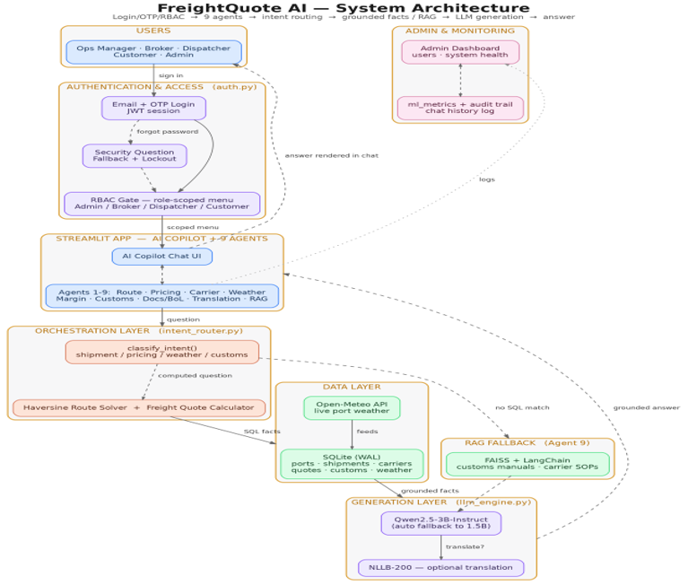
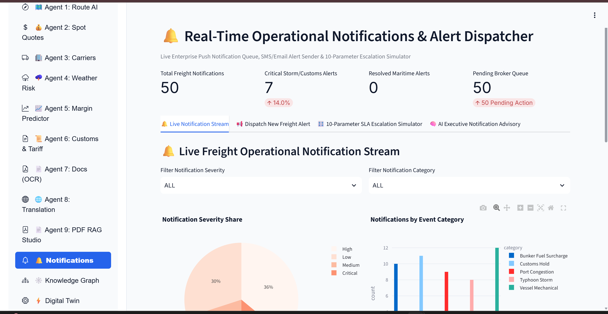

# Infosys_FreightQuote_AI
<div align="center">

# 🚢 FreightQuote AI
### Agentic AI for Maritime Freight Pricing & Route Optimization

**An agentic decision-support copilot for an ocean-freight brokerage — grounded routing, pricing, weather, and compliance answers.**


</div>

---

## 📑 Table of Contents
- [⚡ Quick Start (TL;DR)](#-quick-start-tldr)
- [👥 Program & Team Context](#-program--team-context)
- [🧭 Overall Project Explanation](#-overall-project-explanation)
- [🧭 Project Evolution — What Each Milestone Added](#-project-evolution--what-each-milestone-added)
- [🧩 Main Modules](#-main-modules)
- [🤖 The 9 Specialised Agents](#-the-9-specialised-agents)
- [🔐 Authentication, OTP & Security](#-authentication-otp--security)
- [🛠️ Admin Dashboard](#️-admin-dashboard)
- [🖼️ Screenshots / GIFs](#️-screenshots--gifs)
- [🚀 Getting Started — Step-by-Step Setup Guide](#-getting-started--step-by-step-setup-guide)
- [🔑 Secrets & Credentials (How to Create & Get Each One)](#-secrets--credentials-how-to-create--get-each-one)
- [⚙️ Installation & Run Instructions](#️-installation--run-instructions-from-github)
- [🐳 Running with Docker](#-running-with-docker)
- [📁 Project Structure](#-project-structure)
- [🧑‍💻 How to Use FreightQuote AI (User Walkthrough)](#-how-to-use-freightquote-ai-user-walkthrough)
- [📦 requirements.txt (Strict, Frozen Dependencies)](#-requirementstxt-strict-frozen-dependencies)
- [🎬 Demo Video](#-demo-video)
- [🩺 Troubleshooting / FAQ](#-troubleshooting--faq)
- [📖 Glossary (Simple Terms)](#-glossary-simple-terms)
- [🚧 Known Limitations & Future Scope](#-known-limitations--future-scope)
- [🙏 Acknowledgements](#-acknowledgements)

---

## ⚡ Quick Start (TL;DR)

For anyone who just wants the fastest path from zero to a running app on their own machine — full details, secrets setup, and the Colab path are further down.

```bash
git clone https://github.com/your-org/FreightQuote-AI.git
cd FreightQuote-AI && python -m venv venv && source venv/bin/activate
pip install -r requirements.txt
streamlit run app/main.py
```

> 🪟 **Windows users:** activate with `venv\Scripts\activate` instead of `source venv/bin/activate`.
> 🔑 Before the last command will fully work, copy `.env.example` to `.env` and fill in the secrets described in [🔑 Secrets & Credentials](#-secrets--credentials-how-to-create--get-each-one) — otherwise auth/OTP/LLM features will fail even though the app starts.
> 📓 No local GPU? Use the [Google Colab path](#-getting-started--step-by-step-setup-guide) instead — it's how this project is actually designed to run the Qwen LLM.

---

## 👥 Program & Team Context

> 🎓 **Infosys Springboard Internship — Batch 1**
> 🧑‍🏫 **Mentor:** `MOHAMEDSIPLI M`

### 🌟 Final Team Members

| # | 👤 Team Member | 💼 Contribution |
|:---:|:---------------------------|:----------------|
| 01 | **Tharani Mahasamudram** | Dynamic Margin Predictor & Yield Optimizer · Freight Margin Optimization · Anomaly & Risk Scanner · ML Model Evaluation & Performance Analysis · Alerts & Incident Management |
| 02 | **Kamireddy Samatha Sri** | Customs, Tariff & Regulatory Intelligence · HS Code Classification · Digital Bill of Lading & OCR · Document Processing & Compliance Validation · Knowledge Graph |
| 03 | **Sravya Nanda** | AI Copilot · RAG & Knowledge Base Integration · Natural Language Query Handling · LLM Integration & Prompt Engineering · Grounded Response Generation · AI Copilot Quality & Evaluation |
| 04 | **Yuvanesh V** | Extended Admin Dashboard (Add/Delete/Promote/Demote/Unlock Users) · Route AI & Maritime Fuel Efficiency · Dynamic Freight Pricing · Carrier Performance & Capacity Intelligence · Weather Risk & Storm Telemetry |
| 05 | **Kavya Shree.A** | GitHub & README Documentation · Repository Setup & GitHub Management · RAG Data Pipeline & Data Preparation · Data Cleaning & Preprocessing · User Profile Management · Profile Picture Upload · Change Password Functionality · Integration & Testing Support |
| 06 | **S Sai Laghuvar** | Signup/Login with OTP Verification · Password Recovery with Security Questions · Secure Session/JWT Handling · Logout Functionality |

---

## 🧭 Overall Project Explanation

### ❗ Problem Statement
Ocean-freight brokerages juggle port congestion, volatile fuel-linked pricing, carrier reliability, weather risk, and customs compliance across dozens of live shipments at once — usually across spreadsheets and siloed tools. **FreightQuote AI** gives brokers, dispatchers, and clients a single agentic copilot that answers routing, pricing, weather, and compliance questions **grounded in real data**, instead of relying on manual lookups or an LLM's guesswork.

### ✅ Solution Summary
FreightQuote AI is an agentic decision-support platform for an ocean-freight brokerage. It monitors global ports, calculates dynamic freight quotes, benchmarks carriers, tracks weather and customs risk, and exposes an **LLM-powered copilot** that answers routing, pricing, weather, and compliance questions using **only** grounded database facts, live telemetry, and retrieved documents — never fabricated numbers. Nine specialised agents sit on top of a shared platform layer (authentication, RBAC, translation, alerting, admin tooling), all running inside a single Streamlit application launched from Google Colab.

### 🧭 Project Evolution — What Each Milestone Added

The platform was built incrementally across the internship. Each milestone added a working layer on top of the last, and the final app documented in this README is the sum of all four — you only need to run the current, integrated app; the milestones below are **not** separate apps to set up.

| Milestone | Focus | What Was Delivered |
|---|---|---|
| **Milestone 1** | Authentication & Access | Secure sign-in, account registration, and password recovery via Security Question **or** Email OTP (6-digit, time-limited). Formed the entry point for every later milestone. |
| **Milestone 2** | Core Platform & First Agents | The first working version of the freight platform: Customer & Admin dashboards, and the first 3 AI agents — **Freight Pricing**, **Route/Weather Risk**, and **Carrier Audit** — plus an early AI Copilot. |
| **Milestone 3** | RAG Knowledge Center | Added a Retrieval-Augmented Generation pipeline: 50+ generated logistics SOP/customs/insurance PDFs, chunked and indexed in FAISS, searchable through a dedicated semantic-search dashboard with source-cited answers. This pipeline now powers **Agent 9: PDF RAG Studio**. |
| **Milestone 4** | Full Integration | Everything above was merged into **one connected application**, expanded from 3 agents to **9 specialised agents**, added role-based access control (RBAC) with multiple roles, a full Admin Dashboard, Knowledge Graph, Digital Twin simulation, Anomaly Scanner, Notifications, and multilingual support. This is the current, complete state of the platform. |

### 🧩 Main Modules

| Module | Purpose |
|---|---|
| 🤖 AI Copilot | Answers freight-related questions using retrieved application data |
| 🗺 Route Intelligence | Analyses ports, congestion and possible routes |
| 💰 Freight Pricing | Estimates and compares freight quote components |
| 🚢 Carrier Analytics | Reviews carrier reliability and capacity |
| 🌦 Weather Risk | Evaluates weather conditions affecting port operations |
| 📈 Margin Intelligence | Analyses quote profitability and margin behaviour |
| 🛃 Customs Intelligence | Supports customs and HS-code related risk analysis |
| 📄 Document Generator | Creates freight quote and Bill of Lading documents |
| 🌐 Translation | Translates shipping documents and operational text |
| 📚 PDF RAG | Searches uploaded customs and SOP documents |
| 🚨 Notifications | Displays shipment, weather and customs incidents |
| 🕸 Knowledge Graph | Visualizes relationships between freight entities |
| 🧪 Digital Twin | Simulates changes across the freight network |
| 🔎 Anomaly Scanner | Finds unusual patterns in operational data |
| 📡 Data Feed Center | Provides operational data review/export functionality |

### 🔄 How the Pieces Fit Together (End-to-End Flow)

1. **You sign up / log in** → the auth layer (`auth.py`) issues a JWT session scoped to your role (Admin, Broker, Dispatcher, or Customer).
2. **The app boots two AI engines in the background** → Qwen2.5-3B-Instruct (the reasoning LLM) and NLLB-200 (the translator). A sidebar panel shows you when each is 🟢 Active.
3. **You land on a role-scoped menu** of the 9 agents plus the AI Copilot — RBAC hides tabs you're not permitted to see.
4. **Every agent follows the same internal pattern:**
   - Pulls live rows from its SQLite table(s) (e.g. `ports`, `freight_quotes`, `carriers`).
   - Runs a small benchmark of several classical ML models (Random Forest, Gradient Boosting, SVM, etc.) and picks the best performer.
   - Renders interactive Plotly/Folium visuals plus a hands-on simulator (sliders/inputs you can tweak).
   - Exposes an "Ask the AI" box scoped to that agent's domain.
5. **The AI Copilot** (agent-agnostic chat) routes your free-text question through `intent_router.py` to the right agent's data, retrieves the relevant grounded facts (SQL rows, computed simulator output, or RAG-retrieved PDF passages), and only then asks the LLM to phrase an answer — the LLM is never allowed to invent numbers.
6. **Admins** additionally see a dashboard for user management, system health, and an ML metrics ledger logged to the `ml_metrics` table.

### 🏗️ Architecture Overview



A sidebar status panel — **"🤖 Neural AI Model & GPU Status"** — shows live loading state for both the Qwen and NLLB engines (🟢 Active / 🟡 Loading).

### 🗂️ The 9 Agents at a Glance

| # | 🤖 Agent | ⚡ One-Line Purpose |
|:--|:------|:-------------------|
| 1 | 🧭 Route AI & Maritime Fuel Efficiency Studio | Ocean vessel route optimization, bunker fuel economy & 10-parameter sailing simulator |
| 2 | 💰 Dynamic Freight Pricing Engine | Real-time ocean container spot pricing, margin sensitivity & BAF surcharge engine |
| 3 | 🚛 Carrier Performance & Capacity Intelligence | Carrier reliability ratings, SLA monitoring & 8-parameter capacity simulator |
| 4 | 🌪️ Weather Risk Intelligence & Storm Telemetry | Real-time port cyclone telemetry, vessel delay forecasts & storm simulator |
| 5 | 📈 Dynamic Margin Predictor & Yield Optimizer | AI spot-quote surcharge engine, profit margin regression & rate simulator |
| 6 | 🛃 Customs, Tariff & Regulatory Compliance | HS Code tariff analytics, customs hold probability & duty simulator |
| 7 | 📄 Digital Bill of Lading & Document OCR Studio | AI document OCR scanner, field extractor & fraud detector |
| 8 | 🌐 Multilingual Maritime SOP & Document Translation Studio | Offline translation of freight documents/SOPs & maritime trade glossary (NLLB-200) |
| 9 | 📚 PDF SOP & Freight Document RAG Studio | Upload-your-own-document workbench for customs/SOPs with grounded Q&A |

### 🧰 Full Technology Stack

| Layer | 🔧 Technology | 🎯 Purpose |
|:------|:-----------|:---------|
| 🖥️ Frontend / UI | Streamlit + streamlit-option-menu | Multi-tab dashboard, sidebar navigation, chat UI |
| 🌉 Tunnelling | ngrok / Cloudflare Tunnel | Exposes the Colab-hosted Streamlit app on a public URL |
| ⚙️ Backend language | Python 3 / FastAPI | All application, ML and agent logic |
| 🗄️ Database | SQLite (via `db.py`, WAL mode + connection pooling, 64MB page cache) | Ports, shipments, carriers, freight_quotes, customs data, weather risk, and shared ops tables |
| 🧠 LLM | Qwen2.5-3B-Instruct (4-bit, transformers + bitsandbytes) | Local, in-process natural-language reasoning over grounded facts |
| 🪫 Fallback LLM | Qwen2.5-1.5B-Instruct | Automatic degrade path if the 3B model can't load |
| 🌐 Translation | Facebook NLLB-200 (distilled-600M) | Offline translation of copilot answers & shipping documents (20+ languages) |
| 🔍 RAG / Document Search | pdfplumber + built-in knowledge base (keyword/relevance-scored retrieval) | Retrieval over uploaded customs manuals, carrier SOPs, and auto-indexed PDFs |
| ☁️ Live weather | Open-Meteo REST API via `weather_context.py` | Real current-weather pull per port coordinate, feeding the weather risk agent |
| 🤖 ML models (classical) | scikit-learn — RandomForest, GradientBoosting, DecisionTree, Logistic/Linear Regression, SVC/SVR, Isolation Forest | Per-agent prediction and anomaly detection |
| 📊 Visualization | Plotly Express / Plotly Graph Objects, Folium + streamlit-folium | All interactive charts, port network maps, and storm severity maps |
| 🔐 Auth | PyJWT, bcrypt | OTP-based login, security questions, password hashing, RBAC |
| 🧾 Reporting / Docs | ReportLab / FPDF | PDF Bill of Lading and quote document generation |
| 🌱 Data | Kaggle / Faker | Realistic shipment, carrier, and port records for seeding |

### 🌟 Key Differentiators

| | |
|---|---|
| 🎯 **Grounded generation** | The LLM only answers from retrieved SQL facts, computed solver output (routes, quotes), or RAG-retrieved documents; never fabricated numbers. |
| 🔬 **Transparent ML** | Every predictive agent benchmarks several classical algorithms side-by-side and shows its work. |
| 🛡️ **RBAC role-awareness** | Every tab is gated so an Ops Manager and an Admin see a different, appropriately-scoped menu. |
| 🩹 **Fail-soft LLM degrade path** | If the 3B model can't load, the app automatically degrades to the 1.5B model rather than crashing. |

---

## 🤖 The 9 Specialised Agents

<div align="center">

### 🎛️ AI COPILOT / ORCHESTRATION LAYER
`(intent_router.py)`

**▼ routes each query to the right agent ▼**

| 🧭 1. Route AI | 💰 2. Freight Pricing | 🚛 3. Carrier Performance |
|:---:|:---:|:---:|
| **🌪️ 4. Weather Risk** | **📈 5. Margin Predictor** | **🛃 6. Customs & Tariff** |
| **📄 7. Docs (OCR)** | **🌐 8. Translation** | **📚 9. PDF RAG Studio** |

</div>

---

### 🧭 Agent 1 — Route AI & Maritime Fuel Efficiency Studio

| Field | Details |
|---|---|
| 💼 **Business function** | Ocean vessel route optimization, bunker fuel economy, and port congestion/dwell-time telemetry across monitored global and Indian ports. |
| 🧪 **ML models benchmarked** (10-model comparison) | Random Forest Regressor, Gradient Boosting Regressor, Linear Regression, Ridge Regression, Lasso Regression, SVR, Decision Tree Regressor, MLP Neural Network, K-Means Cluster Model, Isolation Forest Outlier Guard |
| 🏆 **Best model** | **Random Forest Regressor** — R² = **0.96**, RMSE = **0.4 days** 🥇 *"Optimal Best"* |
| 🗄️ **SQL tables read from** | `ports` |
| 📤 **Output to user** | Bar chart (port congestion index by region), Scatter (avg dwell days vs active vessels), model-comparison Bar chart + results table, a 10-parameter vessel sailing simulator (speed/fuel/cost metrics), a Folium port network map, and an AI route advisory Q&A |

---

### 💰 Agent 2 — Dynamic Freight Pricing Engine

| Field | Details |
|---|---|
| 💼 **Business function** | Real-time ocean container spot pricing, margin sensitivity, and BAF (Bunker Adjustment Factor) fuel surcharge calculation. |
| 🧪 **ML models benchmarked** (10-model comparison) | Random Forest Pricing Regressor, Gradient Boosting Regressor, Linear Rate Solver, Ridge Pricing Model, Lasso Rate Model, SVR, Decision Tree Regressor, MLP Neural Network, K-Means Rate Clustering, Isolation Forest Outlier Filter |
| 🏆 **Best model** | **Random Forest Pricing Regressor** — R² = **0.97**, RMSE = **$65 USD** 🥇 *"Optimal Best"* |
| 🗄️ **SQL tables read from** | `freight_quotes` |
| 📤 **Output to user** | Scatter (base cost vs final price) and Histogram (margin % distribution), model-comparison Bar chart + results table, a spot quote & margin calculator, a tariff/customer-tier matrix table, Waterfall (cost build-up), correlation Heatmap, Funnel (quote value by pipeline status), and an AI pricing advisory Q&A |

---

### 🚛 Agent 3 — Carrier Performance & Capacity Intelligence

| Field | Details |
|---|---|
| 💼 **Business function** | Carrier reliability ratings, SLA monitoring, and fleet capacity allocation across ocean carrier partners. |
| 🧪 **ML models benchmarked** (10-model comparison) | Random Forest Ranker, Gradient Boosting Classifier, Logistic Regression Ranker, SVC, Decision Tree Ranker, MLP Neural Network, K-Means Carrier Cluster, PCA + SVM Model, Ridge Classifier, Isolation Forest Outlier Guard |
| 🏆 **Best model** | **Random Forest Ranker** — Accuracy = **0.96**, F1 = **0.95** 🥇 *"Optimal Best"* |
| 🗄️ **SQL tables read from** | `carriers` |
| 📤 **Output to user** | Bar chart (on-time performance %) and Scatter (cost index vs on-time %), model-comparison Bar chart + results table, an 8-parameter capacity/SLA simulator, a carrier risk & SLA ledger table, Treemap (fleet by risk level, colored by rating), correlation Heatmap, and an AI carrier advisory Q&A |

---

### 🌪️ Agent 4 — Weather Risk Intelligence & Storm Telemetry

| Field | Details |
|---|---|
| 💼 **Business function** | Real-time port cyclone/storm telemetry, vessel delay forecasting, and harbor-safety risk monitoring. |
| 🧪 **ML models benchmarked** (10-model comparison) | Random Forest Classifier, Gradient Boosting Classifier, Logistic Regression, SVC, Decision Tree Classifier, MLP Neural Network, Ridge Classifier, K-Means Weather Cluster Model, PCA + SVM Classifier, Isolation Forest Outlier Guard |
| 🏆 **Best model** | **Random Forest Classifier** — Accuracy = **0.95**, F1 = **0.94** 🥇 *"Optimal Best"* |
| 🗄️ **SQL tables read from** | `weather_risks` |
| 📤 **Output to user** | Bar chart (port storm severity) and Scatter (wind speed vs wave height), model-comparison Bar chart + results table, a 10-parameter typhoon/rerouting simulator, a Folium storm-severity map, a corridor storm-risk matrix table, and an AI weather advisory Q&A |

---

### 📈 Agent 5 — Dynamic Margin Predictor & Yield Optimizer

| Field | Details |
|---|---|
| 💼 **Business function** | AI spot-quote surcharge engine and profit-margin regression across quotes, with a carrier yield matrix. |
| 🧪 **ML models benchmarked** (10-model comparison) | Random Forest Regressor, Gradient Boosting Regressor, Linear Regression, Ridge Regression, Lasso Regression, SVR, Decision Tree Regressor, MLP Neural Network, K-Means Cluster Model, Isolation Forest Outlier Guard |
| 🏆 **Best model** | **Random Forest Regressor** — R² = **0.96**, RMSE = **$85 USD** 🥇 *"Optimal Best"* |
| 🗄️ **SQL tables read from** | `freight_quotes` |
| 📤 **Output to user** | Bar chart (avg margin % by carrier) and Scatter (base cost vs final price), model-comparison Bar chart + results table, a 10-parameter rate/surcharge simulator, a carrier yield matrix table, Box plot (margin spread by carrier), correlation Heatmap, Histogram (margin distribution), and an AI margin advisory Q&A |

---

### 🛃 Agent 6 — Customs, Tariff & Regulatory Compliance

| Field | Details |
|---|---|
| 💼 **Business function** | HS Code tariff analytics and customs clearance-hold probability assessment by country and cargo type. |
| 🧪 **ML models benchmarked** (10-model comparison) | Random Forest Risk Classifier, Gradient Boosting Classifier, Logistic Regression, SVC, Decision Tree Classifier, MLP Neural Network, Naive Bayes Tariff Classifier, K-Means Tariff Cluster, Linear Ridge Classifier, Isolation Forest Outlier Guard |
| 🏆 **Best model** | **Random Forest Risk Classifier** — Accuracy = **0.96**, F1 = **0.95** 🥇 *"Optimal Best"* |
| 🗄️ **SQL tables read from** | `customs_tariffs` |
| 📤 **Output to user** | Bar chart (duty rate by cargo category) and Scatter (duty rate vs clearance risk), model-comparison Bar chart + results table, an 8-parameter customs duty simulator, a regulatory document/compliance matrix table, Sunburst (duty exposure by origin country & cargo), and an AI customs advisory Q&A |

---

### 📄 Agent 7 — Digital Bill of Lading & Document OCR Studio

| Field | Details |
|---|---|
| 💼 **Business function** | AI-powered shipping-document OCR scanning, field extraction, and fraud/falsification detection, plus a digital Bill of Lading builder. |
| 🧪 **ML models benchmarked** (10-model comparison) | Random Forest Classifier, Gradient Boosting Classifier, Logistic Regression, SVC, Decision Tree Classifier, MLP Neural Network, Multinomial Naive Bayes, K-Means Cluster Classifier, Ridge Classifier, Isolation Forest Outlier Guard |
| 🏆 **Best model** | **Random Forest Classifier** — Accuracy = **0.97**, F1 = **0.96** 🥇 *"Optimal Best"* |
| 🗄️ **SQL tables read from** | `shipments` |
| 📤 **Output to user** | Extracted OCR text payload + a structured JSON metadata card, model-comparison Bar chart + results table, a 10-parameter digital Bill of Lading builder, and an AI document advisory Q&A |

---

### 🌐 Agent 8 — Multilingual Maritime SOP & Document Translation Studio

| Field | Details |
|---|---|
| 💼 **Business function** | Offline translation of freight documents, maritime SOPs, and trade terminology into 20+ languages. |
| 🧪 **ML models benchmarked** | ❌ None — powered by a single translation model, Facebook **NLLB-200-distilled-600M**, not a classical multi-model ML benchmark, so no "best of several" selection applies |
| 🗄️ **SQL tables read from** | ❌ None — translates a built-in dictionary of maritime SOPs and glossary terms (not database-backed) |
| 📤 **Output to user** | Real-time translated text, a translated SOP document view, batch-translated SOPs with a downloadable file, a translated maritime trade glossary (BAF, TEU, Net Margin %, HS Code, Dwell Time, Congestion Index, Reliability Score), and a supported-languages table |

---

### 📚 Agent 9 — PDF SOP & Freight Document RAG Studio

| Field | Details |
|---|---|
| 💼 **Business function** | Upload-your-own-document workbench for customs policies, logistics SOPs, and tariff rules, with natural-language Q&A grounded in the uploaded content. |
| 🧪 **ML models benchmarked** | ❌ None — uses `pdfplumber` for text extraction and a keyword/relevance-scored retrieval over a built-in knowledge base plus uploaded documents, not a classical ML benchmark |
| 🗄️ **SQL tables read from** | ❌ None directly — retrieves from an in-memory document knowledge base (built-in SOPs + any uploaded/auto-indexed PDFs), not the SQL database |
| 📤 **Output to user** | An extracted-document text preview and a ranked list of RAG search results, each with its source document and a relevance score |

---

### 📖 Maritime Glossary

| Term | 📝 Meaning |
|:-----|:--------|
| 🔤 **BAF** | Bunker Adjustment Factor — a fuel-price surcharge added to the base ocean freight rate |
| 🔤 **TEU** | Twenty-foot Equivalent Unit — the standard unit for measuring container capacity |
| 🔤 **HS Code** | Harmonized System Code — the international classification code for traded goods, used for customs/duty assessment |
| 🔤 **Dwell Time** | The time a container spends sitting at a port terminal before being loaded/moved |
| 🔤 **Bill of Lading (BoL)** | The legal shipping document issued by a carrier acknowledging receipt of cargo and detailing the terms of transport |
| 🔤 **RAG** | Retrieval-Augmented Generation — the AI looks up real documents before answering, instead of guessing |
| 🔤 **RBAC** | Role-Based Access Control — different users see different features depending on their assigned role |
| 🔤 **OTP** | One-Time Password — a temporary, time-limited code sent to your email to verify it's really you |

---

## 🔐 Authentication, OTP & Security

**Auth flow** (implemented in `auth.py`, using PyJWT + bcrypt, with account lockout/cooldown after repeated failed attempts):

```
   ┌──────────┐     ┌──────────┐     ┌──────────────────┐
   │  Signup  │ ──▶ │  Login   │ ──▶ │  JWT Session      │
   └──────────┘     └────┬─────┘     │  (RBAC-scoped     │
                         │           │   app access)      │
                         │           └──────────────────┘
                         │
                  (Forgot Password)
                         │
                         ▼
                ┌──────────────────┐
                │   OTP sent to     │
                │ registered email  │
                └────────┬──────────┘
                         │
              ┌──────────┴──────────┐
              │                     │
        OTP correct           OTP incorrect
              │                     │
              ▼                     ▼
      ┌───────────────┐   ┌────────────────────┐
      │ Reset Password │   │ Security Question   │
      │                │   │ Fallback             │
      └───────┬────────┘   └──────────┬──────────┘
              │                        │
              │                answer correct?
              │                        │
              ▼                        ▼
        back to Login          Reset Password ──▶ back to Login
```

> 🔒 OTP delivery and any credentials are configured via environment variables and are **never** committed to the repository — see the [🔑 Secrets & Credentials](#-secrets--credentials-how-to-create--get-each-one) section below.

### 🛡️ RBAC Roles

| Role | 🎫 Typical Access |
|:-----|:-----------------|
| 👑 **Admin** | All tabs, including the Admin Dashboard and full agent suite |
| 🧑‍💼 **Freight Broker / Regional Ops Manager** | All agents and the AI Copilot, excluding the Admin Dashboard |
| 🧑‍✈️ **Dispatcher** | AI Copilot + a subset of operational agents |
| 🧑‍🤝‍🧑 **Customer / Client** | AI Copilot plus quote-related agents only |

---

## 🛠️ Admin Dashboard


### 👑 Admin-only capabilities
- 👥 User management & role assignment
- 💓 System health monitoring (DB status, LLM/translation engine status)
- 📊 ML model performance ledger (accuracy/F1/R² per agent, logged to the `ml_metrics` table)
- 🕵️ Chat history & audit trail across users

---

## 🖼️ Screenshots / GIFs
### Login & Access

*Secure sign-in screen with role-based demo credentials.*

### OTP Section

OTP verification provides secure authentication using a one-time password.

### Sign Up

The Sign Up page allows new users to create an account securely.

### Admin Dashboard

*Command-center overview of shipments, quotes, and platform-wide KPIs.*

### AI Copilot

*Grounded chat assistant answering questions using live freight data.*

### Route Optimization (Agent 1)

*Interactive port-to-port route mapping and optimization analysis.*

### Dynamic Freight Pricing (Agent 2)

*Real-time dynamic pricing engine for freight quotes.*

### Carrier Performance (Agent 3)

*Carrier capacity, reliability, and performance analytics.*

### Weather & Freight Risk (Agent 4)

*Live port weather overlays and shipment risk scoring.*

### Margin Predictor (Agent 5)

*Predicted yield and margin outlook across active shipments.*

### Customs & Tariffs (Agent 6)

*Customs, tax, and compliance guidance for cross-border shipments.*

### Digital Bill of Lading (Agent 7)

*Automated generation and management of shipping documents.*

### Alerts & Translation (Agent 8)

*Real-time incident alerts alongside 20+ language translation support.*

### PDF SOP / RAG Studio (Agent 9)

*Upload and query customs/SOP PDFs using retrieval-augmented search.*

### Notifications

Displays important alerts and updates related to freight operations and system activities.

### Anomaly Scanner

*Isolation Forest–based detection of anomalies across shipments and ports.*

### Digital Twin Simulation

*Monte Carlo trade-stress simulation of the global freight network.*

### Knowledge Graph

*Interactive graph linking ports, carriers, shipments, and documents.*

### Data Feed Center

*Manual and bulk CSV data ingestion into the live database.*

---

## 🚀 Getting Started — Step-by-Step Setup Guide

This section is written for someone setting the project up **for the very first time**, with zero assumed context. There are two ways to run FreightQuote AI — pick one:

| Path | Best for | Needs a GPU on your own machine? |
|---|---|---|
| **A. Google Colab** (recommended) | Anyone without a local GPU — this is how the team built and demoed it | ❌ No — Colab provides a free GPU |
| **B. Local machine** | Developers who already have a CUDA-capable GPU (≥6GB VRAM) | ✅ Yes |

### 🅰️ Path A — Run on Google Colab (recommended, no GPU needed)

1. **Get the code onto Colab.**
   - Open [Google Colab](https://colab.research.google.com/).
   - `File → Open notebook → GitHub`, paste the repo URL, and open the project notebook (or upload the repo as a `.zip` and unzip it in a Colab cell with `!unzip`).
2. **Turn on a GPU runtime.**
   - `Runtime → Change runtime type → Hardware accelerator → GPU (T4 is enough)`.
3. **Add your secrets to Colab (never hardcode them in the notebook).**
   - Click the 🔑 **key icon** in the left sidebar of Colab ("Secrets").
   - Add each variable listed in the [Secrets & Credentials](#-secrets--credentials-how-to-create--get-each-one) table below as a new secret (name must match exactly, e.g. `HF_TOKEN`).
   - Toggle **"Notebook access"** on for each secret.
   - At the top of the notebook, load them into the environment:
     ```python
     import os
     from google.colab import userdata
     for key in ["HF_TOKEN", "KAGGLE_USERNAME", "KAGGLE_KEY", "OTP_EMAIL_ADDRESS",
                 "OTP_EMAIL_APP_PASSWORD", "JWT_SECRET_KEY", "ADMIN_EMAIL",
                 "ADMIN_PASSWORD", "NGROK_AUTH_TOKEN"]:
         os.environ[key] = userdata.get(key)
     ```
4. **Install dependencies** (first cell): `!pip install -r requirements.txt`
5. **Seed the database** (first run only): `!python seed_data.py`
6. **Start the tunnel**, then launch Streamlit:
   ```python
   !pip install pyngrok -q
   from pyngrok import ngrok
   ngrok.set_auth_token(os.environ["NGROK_AUTH_TOKEN"])
   public_url = ngrok.connect(8501)
   print("Open this URL:", public_url)
   !streamlit run app.py &>/content/logs.txt &
   ```
   *(Cloudflare Tunnel works the same way if you'd rather avoid an ngrok account — see the note in the Secrets table.)*
7. **Open the printed public URL** in your browser — that's your live app.

### 🅱️ Path B — Run on your own machine

Skip straight to [⚙️ Installation & Run Instructions](#️-installation--run-instructions-from-github) below — it covers the local `venv` + `.env` flow.

### ✅ First-Login Checklist

Once the app is open in your browser:
1. Use the **seeded admin account** (`ADMIN_EMAIL` / `ADMIN_PASSWORD` from your `.env` or Colab secrets) to log in as Admin the first time.
2. From the **Admin Dashboard**, create additional users and assign them roles (Broker, Dispatcher, Customer) so you can see the RBAC-scoped menus.
3. Confirm the sidebar shows 🟢 **Active** for both the Qwen and NLLB engines before relying on AI answers — while 🟡 **Loading**, give it a minute (model weights are several GB and load once per session).
4. Try the **AI Copilot** tab first with a simple question like *"Which port has the highest congestion index right now?"* — this is the fastest way to confirm the LLM, database, and grounding pipeline are all wired up correctly.

---

## 🔑 Secrets & Credentials (How to Create & Get Each One)

All credentials are supplied via environment variables (locally through `.env`, or as Colab **Secrets** when run in Google Colab) and are **never** committed to the repository — only `.env.example` with empty/placeholder values is tracked.

| Variable | 🎯 Purpose | 📍 Where to get it |
|:---|:---|:---|
| `HF_TOKEN` | HF token for Qwen2.5 weights | HF → Settings → Access Tokens |
| `KAGGLE_USERNAME` / `KAGGLE_KEY` | Kaggle API creds for seeding | Kaggle → Account → New API Token |
| `OTP_EMAIL_ADDRESS` | Mailbox that sends OTP emails | Dedicated project mailbox |
| `OTP_EMAIL_APP_PASSWORD` | Gmail app password for SMTP | Google Account → Security → App Passwords (2FA req'd) |
| `JWT_SECRET_KEY` | Signing key for session tokens | Generate locally (see note below) |
| `ADMIN_EMAIL` | Seeded default admin email | Set by the team |
| `ADMIN_PASSWORD` | Seeded default admin password | Set by the team (strong, unique) |
| `NGROK_AUTH_TOKEN` | Token to expose app via ngrok | ngrok.com → Your Authtoken |

### 🪜 Step-by-step: creating each secret from scratch

**1. `HF_TOKEN` (Hugging Face token — needed to download Qwen2.5 & NLLB-200 weights)**
1. Create a free account at [huggingface.co](https://huggingface.co/join).
2. Go to **Settings → Access Tokens** (`huggingface.co/settings/tokens`).
3. Click **New token**, give it a name (e.g. `freightquote-ai`), set the role to **Read**, and click **Generate**.
4. Copy the token immediately (`hf_...`) — you can't view it again later, only regenerate it.
5. Some gated model pages (if any are used) may also require you to click **"Agree and access repository"** on the model's Hugging Face page while logged in.

**2. `KAGGLE_USERNAME` / `KAGGLE_KEY` (only needed if you re-seed data from Kaggle datasets)**
1. Create a free account at [kaggle.com](https://www.kaggle.com/).
2. Go to **Account → Settings** (click your profile picture → *Settings*).
3. Scroll to the **API** section and click **Create New Token** — this downloads a `kaggle.json` file.
4. Open that file; it contains `{"username": "...", "key": "..."}`. Use those two values as `KAGGLE_USERNAME` and `KAGGLE_KEY`.

**3. `OTP_EMAIL_ADDRESS` + `OTP_EMAIL_APP_PASSWORD` (the mailbox that sends OTP codes to users)**
1. Create (or reuse) a **dedicated project Gmail account** — don't use a personal inbox.
2. Turn on **2-Step Verification**: Google Account → **Security → 2-Step Verification → Get started**.
3. Once 2FA is on, go to **Security → App passwords** (`myaccount.google.com/apppasswords`).
4. Select app: *Mail*, select device: *Other (custom name)* → type `FreightQuote AI` → **Generate**.
5. Google shows a 16-character password (e.g. `abcd efgh ijkl mnop`) — copy it with spaces removed as `OTP_EMAIL_APP_PASSWORD`. This is **not** the account's normal login password.
6. Set `OTP_EMAIL_ADDRESS` to the full Gmail address of this mailbox.

**4. `JWT_SECRET_KEY` (signs and verifies login session tokens)**
- This one you generate yourself, locally — it's not obtained from any website. Run:
  ```bash
  python -c "import secrets;print(secrets.token_hex(32))"
  ```
- Copy the printed 64-character hex string as the value. Treat it like a password — anyone with this key could forge valid login sessions.

**5. `ADMIN_EMAIL` / `ADMIN_PASSWORD` (the first account you log in with)**
- Pick any email-shaped string and a strong password yourself — these just seed the first Admin row in the database via `seed_data.py`. Change the default demo password before sharing the app with anyone else.

**6. `NGROK_AUTH_TOKEN` (only needed if you use ngrok instead of Cloudflare Tunnel to expose the Colab app publicly)**
1. Create a free account at [ngrok.com](https://ngrok.com/).
2. Go to the dashboard's **"Your Authtoken"** page (`dashboard.ngrok.com/get-started/your-authtoken`).
3. Copy the token shown there.
4. *(Alternative: skip ngrok entirely and use Cloudflare Tunnel, which needs no account for quick/ephemeral tunnels — run `cloudflared tunnel --url http://localhost:8501` instead.)*

### 📝 Putting it all together locally

```bash
cp .env.example .env
```
Then open `.env` in a text editor and paste in each value you generated above:
```env
HF_TOKEN=hf_xxxxxxxxxxxxxxxxxxxxxxxxxxxx
KAGGLE_USERNAME=your_kaggle_username
KAGGLE_KEY=your_kaggle_key
OTP_EMAIL_ADDRESS=freightquote.otp@gmail.com
OTP_EMAIL_APP_PASSWORD=abcdefghijklmnop
JWT_SECRET_KEY=your_generated_64_char_hex_string
ADMIN_EMAIL=admin@freightquote.ai
ADMIN_PASSWORD=Choose_A_Strong_Unique_Password!
NGROK_AUTH_TOKEN=your_ngrok_token
```

> 📝 **Notes:**
> - `OTP_EMAIL_ADDRESS` / `OTP_EMAIL_APP_PASSWORD`: use a dedicated project/team mailbox, not a personal one. The app password is **not** your real Gmail password.
> - `JWT_SECRET_KEY`: generate with `python -c "import secrets;print(secrets.token_hex(32))"`.
> - `ADMIN_PASSWORD`: use a strong, unique value — don't ship the `admin123` demo default.
> - `NGROK_AUTH_TOKEN`: only needed if using ngrok instead of Cloudflare Tunnel.

> ⚠️ **If any token or password above is ever accidentally committed, treat it as compromised:** revoke/rotate it immediately (Hugging Face/Kaggle: delete & regenerate the token; Google: revoke the App Password) — do not just delete the line in a later commit, since it remains in git history.

---

## ⚙️ Installation & Run Instructions (from GitHub)

```bash
# 1️⃣ Clone the repository
git clone https://github.com/<org-or-user>/freightquote-ai.git
cd freightquote-ai

# 2️⃣ Create and activate a virtual environment
python -m venv venv
source venv/bin/activate   # Windows: venv\Scripts\activate

# 3️⃣ Install dependencies
pip install -r requirements.txt

# 4️⃣ Configure environment variables
cp .env.example .env
# then open .env and fill in YOUR OWN values (see Secrets & Credentials section)

# 5️⃣ Seed the database (first run only)
python seed_data.py

# 6️⃣ Run the app
streamlit run app.py
```

### ☁️ Run on Google Colab

Since the platform is designed to run from **Google Colab** with Streamlit tunnelled out via ngrok / Cloudflare Tunnel:

1. 📓 Open the project notebook: `<Colab notebook link>`
2. ▶️ Run cells in this exact order:
   1. Install dependencies (`pip install -r requirements.txt`)
   2. Mount/set Colab **Secrets** for `HF_TOKEN`, `OTP_EMAIL_ADDRESS`, `OTP_EMAIL_APP_PASSWORD`, `JWT_SECRET_KEY`, etc.
   3. Run `seed_data.py` to populate SQLite
   4. Launch the ngrok/Cloudflare tunnel
   5. Run `streamlit run app.py` (or the notebook's launch cell)
3. 🔗 Open the public tunnel URL printed in the notebook output.

### 📋 Minimum Requirements

| Requirement | Spec |
|:---|:---|
| 🐍 **Python** | 3.10+ |
| 🎮 **RAM/VRAM** | A GPU with **≥ 6 GB VRAM** is recommended for the Qwen2.5-3B-Instruct model (4-bit quantized). If sufficient VRAM isn't available, the app **automatically degrades to the Qwen2.5-1.5B-Instruct** fallback model rather than crashing. |
| 💾 **Disk space** | Several GB free for LLM + NLLB-200 model weights |

---

## 🐳 Running with Docker

If you'd rather not manage a local Python environment, the app can also run in a container. This assumes a `Dockerfile` is present at the repository root (add one if it isn't yet).

```bash
# 1️⃣ Build the image
docker build -t freightquote-ai .

# 2️⃣ Run the container, passing your .env file through and mapping the Streamlit port
docker run --env-file .env -p 8501:8501 freightquote-ai
```

Then open **http://localhost:8501** in your browser. Notes:
- The `--env-file .env` flag loads all the secrets described in [🔑 Secrets & Credentials](#-secrets--credentials-how-to-create--get-each-one) into the container — build the `.env` file first.
- GPU access inside Docker (for faster LLM inference) requires the [NVIDIA Container Toolkit](https://docs.nvidia.com/datacenter/cloud-native/container-toolkit/latest/install-guide.html) and running with `--gpus all`; without it, the app falls back to CPU inference (slower, but functional).
- For first-time setup, run the database seed step once, either by baking it into the image build or by `docker exec`-ing into the running container: `docker exec -it <container_id> python seed_data.py`.

---

## 📁 Project Structure

```text
freightquote-ai/
│
├── app/
│   └── main.py              # Streamlit entry point (or app.py at repo root, depending on layout)
│
├── admin_dash.py             # Admin Dashboard
├── ai_copilot.py             # Cross-agent AI Copilot / intent router
├── profile.py                # User profile management
│
├── agent1_route.py           # Port & Route Intelligence
├── agent2_pricing.py         # Dynamic Freight Pricing
├── agent3_carrier.py         # Carrier Performance
├── agent4_weather.py         # Weather & Harbor Risk
├── agent5_margin.py          # Freight Margin Intelligence
├── agent6_customs.py         # Customs & HS Code Intelligence
├── agent7_docs.py            # Freight Document Generator (OCR + Bill of Lading)
├── agent8_translation.py     # Maritime Translation (NLLB-200)
├── agent9_pdf_rag.py         # PDF RAG Studio
│
├── anomaly_scanner.py        # Isolation Forest anomaly detection
├── digital_twin.py           # Monte Carlo network simulation
├── knowledge_graph.py        # Entity relationship visualization
├── notifications.py          # Operational incident alerts
├── data_feed_center.py       # Manual/bulk CSV data ingestion
│
├── auth.py                   # Signup, login, OTP, password recovery
├── rbac.py                   # Role-based access control
├── db.py                     # SQLite connection layer (WAL mode, pooling)
├── seed_data.py               # Database seeding (Kaggle/Faker demo data)
├── llm_engine.py              # Qwen2.5-3B/1.5B model loading & inference
├── translation_engine.py      # NLLB-200 wrapper
├── rag_engine.py               # FAISS + sentence-transformers RAG pipeline
├── model_server.py             # Shared model-serving utilities
│
├── config.py                   # App configuration / env var loading
├── ui_theme.py                 # Streamlit theming
├── requirements.txt             # Frozen, pinned dependencies
├── .env.example                  # Placeholder env vars (safe to commit)
├── Dockerfile                     # Container build definition
└── docs/                           # Architecture diagram + screenshots
```

> 📝 Adjust this tree to match your actual repository layout before publishing — it's meant as a map for new contributors, not a guarantee of exact filenames.

---

## 🧑‍💻 How to Use FreightQuote AI (User Walkthrough)

### 1. Create an account or log in
- On the landing page, choose **Sign Up** if you're new: fill in name, email, password, and set up a security question (used for password recovery if OTP email fails).
- Existing users choose **Login** and enter email + password.
- Forgot your password? Click **Forgot Password** → an OTP is emailed to your registered address → enter it to reset, or fall back to your security question if the OTP doesn't arrive.
- After login, you land on the role-scoped **main menu** in the sidebar (`streamlit-option-menu`).

### 2. Check system status
- Glance at the sidebar's **"🤖 Neural AI Model & GPU Status"** panel. Wait for both engines to show 🟢 **Active** before asking the copilot anything — while 🟡 **Loading**, ML-agent charts still work (they don't need the LLM), but chat answers will be slower or unavailable.

### 3. Explore a specialised agent
Pick any tab from the 9 agents (e.g. **💰 Dynamic Freight Pricing Engine**):
- Review the auto-generated charts (they reflect the current state of the SQLite database).
- Open the **model-comparison table** to see which classical ML model won the benchmark and why.
- Use the **simulator** (sliders/number inputs specific to that agent) to test "what-if" scenarios — e.g. change bunker fuel price or vessel speed and watch the projected cost/margin update.
- Scroll to that agent's **AI advisory Q&A box** and ask a domain-specific question in plain English, e.g. *"Why is the BAF surcharge higher on the Shanghai–Rotterdam lane this week?"*

### 4. Ask the AI Copilot (cross-agent chat)
- Open the **AI Copilot** tab for a general chat interface that isn't tied to one agent.
- Type a natural-language question — `intent_router.py` figures out which agent's data is relevant, retrieves grounded facts, and the LLM phrases a grounded answer citing those facts.
- If your question needs multilingual output, use the **🌐 Translation Studio** to translate the copilot's answer or a source document into 20+ languages offline.

### 5. Work with documents
- **📄 Bill of Lading & OCR Studio**: upload a shipping document image/PDF, let OCR extract fields, review the fraud-detection flag, then use the 10-parameter builder to generate a clean digital Bill of Lading (PDF output via ReportLab/FPDF).
- **📚 PDF SOP & RAG Studio**: upload your own customs policy or SOP PDF; it's auto-indexed into the retrieval knowledge base, after which you can ask questions and get answers grounded in that specific document, with a relevance-scored source list.

### 6. (Admins only) Manage the platform
- Open the **Admin Dashboard** to add/delete/promote/demote/unlock users, monitor DB and model health, review the ML metrics ledger, and audit chat history across all users.

### 7. Log out
- Use the sidebar **Logout** button to end your JWT session cleanly.

---

## 📦 requirements.txt (Strict, Frozen Dependencies)

See [`requirements.txt`](requirements.txt) in the repository root for the full pinned dependency list. To keep builds reproducible, this file must stay **strict**:

- **Exact, pinned versions only** — every line looks like `package==1.2.3`, never `package>=1.2.3` or an unpinned `package`. This guarantees anyone who clones the repo gets byte-for-byte the same environment you tested with.
- **No redundant or unused packages** — only libraries the app actually imports at runtime belong here; leftover packages from experimentation should be removed before committing.
- **Regenerate it from your working virtual environment**, don't hand-edit version numbers:
  ```bash
  # inside your activated venv, after confirming the app runs correctly
  pip freeze > requirements.txt
  ```
- **Review the diff before committing** — `pip freeze` captures everything installed in the environment, including transitive dependencies pulled in by tools you used only for development (e.g. Jupyter, linters). Strip anything that isn't actually needed to run `streamlit run app/main.py`.
- **Re-freeze whenever you add or upgrade a dependency**, and commit the updated `requirements.txt` in the same PR as the code change that needed it, so the two never drift apart.

> ⏳ **Install note:** expect installation to take several minutes and several GB of free disk space — `torch`, `transformers`, and `bitsandbytes` are large, and the Qwen2.5 + NLLB-200 model weights add several more GB on first run.

---

## 🎬 Demo Video

▶️ See [`demo.mp4`](demo.mp4) for the full demo recording.

---

## 🩺 Troubleshooting / FAQ

| Symptom | Likely cause & fix |
|---|---|
| Sidebar status stuck on 🟡 Loading | Model weights are still downloading/loading into VRAM — this can take a few minutes on first run per session; check the Colab cell output/logs for download progress. |
| `CUDA out of memory` or the LLM silently gets slower | Not enough VRAM for the 3B model — the app should auto-degrade to Qwen2.5-1.5B-Instruct; if it doesn't, restart the runtime and re-run cells in order. |
| OTP email never arrives | Double-check `OTP_EMAIL_ADDRESS`/`OTP_EMAIL_APP_PASSWORD` are correct, that 2-Step Verification is enabled on that Gmail account, and that you generated an **App Password** (not the account's normal password). Also check spam folders. |
| ngrok URL says "tunnel not found" or expires quickly | Free ngrok tunnels are ephemeral and reset on reconnect — reconnect and use the newly printed URL, or switch to Cloudflare Tunnel for a more persistent option. |
| `sqlite3.OperationalError: database is locked` | Multiple processes writing at once — the DB layer uses WAL mode to minimize this, but avoid running `seed_data.py` while the app is already live. |
| Can't see the Admin Dashboard tab | Your logged-in account isn't seeded/promoted as Admin — log in with `ADMIN_EMAIL`/`ADMIN_PASSWORD`, or have an existing Admin promote your account from the Admin Dashboard. |

---

## ❓ Quick FAQ

**Q: Do I need a GPU to run this?**
A local LLM (Qwen) works best with a GPU, which is why the project is designed to run on Google Colab. It can fall back to a smaller model or CPU mode if no GPU is available, though responses will be slower.

**Q: Is the data real?**
No — ports, shipments, carriers, and customer data are generated for demo purposes. Only the live weather data (from Open-Meteo) is real-time.

**Q: Can the AI Copilot make up numbers?**
It's designed not to. The Copilot is instructed to answer only from data it can retrieve (the database or uploaded PDFs) and to say so clearly when it doesn't have enough information.

**Q: What happens if the 3B model can't load?**
The app automatically falls back to the smaller Qwen2.5-1.5B-Instruct model so the Copilot keeps working, just with slightly less detailed responses.

**Q: Why does the README talk about "Milestones" — do I need to run them separately?**
No. Milestones 1–3 were development stages; everything they built is already merged into the single, current application described in this README. You only need to run the current app once, following the [Getting Started guide](#-getting-started--step-by-step-setup-guide).

**Q: The Quick Start command says `streamlit run app/main.py` but I only see `app.py` at the repo root — which is right?**
Use whichever path actually exists in your clone. Some layouts keep the entry point at the repo root (`app.py`), others nest it under an `app/` package (`app/main.py`) — check your [Project Structure](#-project-structure) and adjust the run command accordingly.

---

## 🚧 Known Limitations & Future Scope

### ⚠️ Limitations
- 🧪 Uses synthetic (Kaggle/Faker-generated) data rather than live commercial freight data
- 🏢 Single-tenant deployment; not built for multi-brokerage isolation
- 🗄️ SQLite is used instead of a production-grade database (e.g. PostgreSQL)
- 🧠 LLM reasoning is limited to the locally-hosted Qwen2.5-3B/1.5B models — no external frontier-model fallback

### 🔮 Future Scope
- 🛰️ Integrate real-time freight-rate and AIS vessel-tracking data feeds
- 🗄️ Migrate to a production database (PostgreSQL/MySQL) with proper multi-tenant support
- 🔔 Add push/email/SMS alerting for weather and customs risk events
- 📚 Expand the RAG knowledge base to ingest live regulatory-body publications automatically

---

## 🙏 Acknowledgements

<div align="center">

This project was built as part of the **Infosys Springboard Internship — Batch 1**.
💐 Thanks to our mentor, **MOHAMEDSIPLI M**, for guidance and feedback throughout development.

</div>
